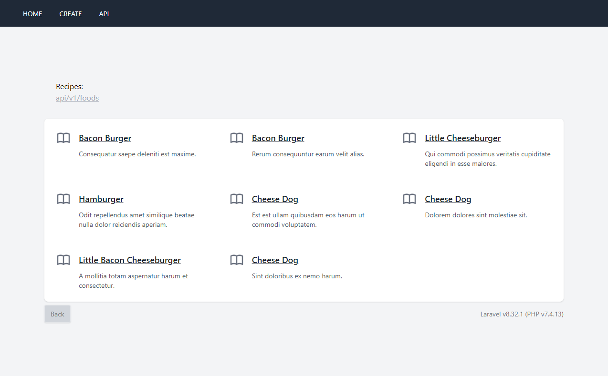

## Simple food api

> Basic CRUD app. api route: api/v1/foods, web route: /

* download project
* run:
``` php artisan key:generate ```
* rename .env.example to .env 
* change db credentials and seed db:
``` php artisan migrate --seed ```
* run:
``` php artisan serve ```
